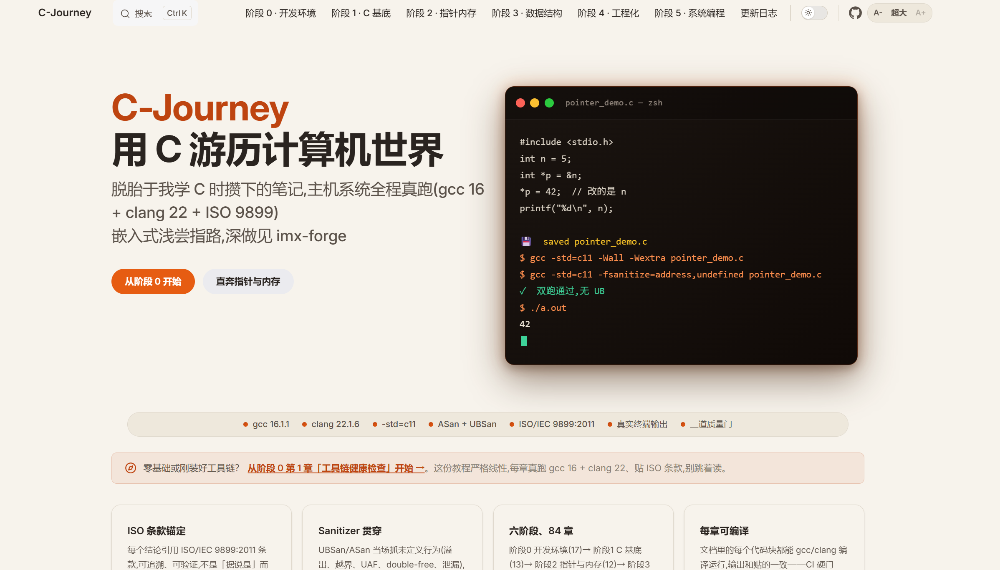
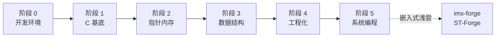

# C-Journey

[](https://github.com/Awesome-Embedded-Learning-Studio/C-Journey/actions/workflows/ci.yml)
[](./LICENSE)

嘿！这里是C-Journey! 最开始的时候呢，是笔者的大学针对C语言，和使用C完成的一些领域学习的笔记！经过相当漫长的时间的改造，今天主骨架大致完成啦！笔者花费一些时间，将可验证的代码收集成可以被CI验证，将笔记梳理成可以游历计算机世界的一套，也许可以说是“教程”的仓库！

> 嘿，点一下下面的图片！进入C语言的世界！

<p align="center">
  <a href="https://awesome-embedded-learning-studio.github.io/C-Journey/">
    
  </a>
</p>


## 现在到哪了

主线六阶段已经全部写完上线,共 84 章:



| 阶段 | 章 | 内容 |
|---|---|---|
| 0 开发环境 | 17 | 工具链 / 编译四阶段 / 链接与动态库 / 警告体系 / sanitizer / make / cmake / gdb / Git / CI / clang-format |
| 1 C 基底 | 13 | 程序结构 / 类型与算术 / 运算符 / 控制流 / 函数 / 作用域 / 数组 / 字符串 / IO / 结构体联合枚举 |
| 2 指针与内存 | 12 | 指针算术 / 动态内存 / 函数指针 / void\* 与字节操作 / 内存六区布局 |
| 3 数据结构 | 12 | 链表 / 栈队列 / 动态数组 / 二叉树与 BST / 哈希表 / 查找排序 / 大 O |
| 4 工程化 | 16 | 头文件契约 / API / 错误处理 / CMake 工程化 / 库与链接 / 测试与 Mock / gdb / ASan 与 valgrind / 静态分析 / 覆盖率 / 性能剖析 / CI 流水线 |
| 5 系统编程 | 14 | 文件 IO / fork-exec / 守护进程 / 信号 / pipe 与共享内存 / select 与 epoll / 非阻塞 reactor / socket TCP/UDP / getaddrinfo |

阶段 6(嵌入式)和阶段 7(capstone)还没动笔——深做交给 imx-forge / ST-Forge,这里将来也只浅尝开个门。完整设计思路见 [ROADMAP](https://awesome-embedded-learning-studio.github.io/C-Journey/roadmap)。

## 怎么读、怎么改

按阶段顺序读 `documents/`(阶段 1 有[导读](./documents/01-c-basics/index.md));配套可编译示例在 `examples/`,完整项目在 `projects/`。改了东西,本地过两道门再提 PR:

```bash
python3 scripts/build_examples.py        # 编译所有 examples(gcc + clang 硬门)
python3 scripts/validate_frontmatter.py  # 校验文档 frontmatter
```

环境搭建、加文档和示例的规范、CI 的六道门(编译 / sanitize / 静态分析 / 覆盖率 / format / 文档校验),都写在 [CONTRIBUTING](./CONTRIBUTING.md) 里。

## 贡献

Issue 和 PR 都热烈欢迎, 不必拘束，小到错别字，大到您的笔记提交,我们都热烈欢迎！更新日志在[站点上](https://awesome-embedded-learning-studio.github.io/C-Journey/changelog/),按里程碑记了每个阶段的收官。
