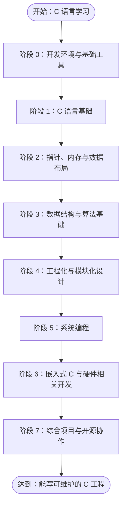

# C-Journey

A learning journal + community hub for C beginners and learners.

> 目标：不只是“会写 C 语法”，而是逐步具备使用 C 语言完成真实工程、库设计、系统编程、嵌入式开发的能力。

## 路线概览



## 内容亮点

> **8 个阶段全部有内容，共 41 篇文档**（见 [documents/](./documents/)）；`examples/` 与 `projects/` 里的 C 代码全部由 CI 编译通过。

- **阶段 0 ~ 1**：开发环境、编译调试、Git —— 以及 **20 章从零到扎实的 C 基础**（程序结构、数据类型、运算符、控制流、函数、指针、结构体、动态内存、多文件工程）
- **阶段 2 ~ 3**：指针 / 内存布局深入 + C 陷阱集；数据结构手搓（泛型容器、动态数组、单链表、递归、查找排序）
- **阶段 4**：工程化（CMake 基础 + 进阶、符号与链接、ASan/UBSan、性能剖析）
- **阶段 5**：系统编程（socket 基础 + 进阶、stdio 与文件 IO）
- **阶段 6**：嵌入式（8051 裸机、Linux 字符设备驱动）
- **阶段 7**：综合 —— [自制操作系统](./documents/07-capstone/0-hand-written-os.md)（对接 `projects/os-from-scratch`）

## 适合人群

- 已学过 C 语法，希望系统提升工程能力的开发者
- 在校学生或转嵌入式/系统方向的学习者
- 希望有一份“可落地”的 C 语言进阶路线图的团队或个人

## 如何使用

1. 按阶段顺序学习，每个阶段先阅读 [documents/](./documents/) 中的知识点文档（阶段 1 从 [导读](./documents/01-c-basics/index.md) 进）
2. 完成 [examples/](./examples/) 中对应的实践，参考 [projects/](./projects/) 中的完整项目
3. 在 `exercises/` 中做附加练习
4. 最终挑战综合项目，并尝试提交 PR 参与开源

> 改了文档 / 代码后，本地过一下质量门：`python3 scripts/build_examples.py`、`python3 scripts/validate_frontmatter.py`（详见 [CONTRIBUTING.md](./CONTRIBUTING.md)）。

## 仓库结构

```text
C-Journey/
├── documents/          # 41 篇知识点文档（8 阶段，见 documents/README.md）
├── examples/           # 可编译示例（编译调试 / C 基础 / TCP socket，CI 编译）
├── projects/           # 完整项目（clib-utilities、os-from-scratch、embedded-mcu、song、tiny-c-stdlib）
├── exercises/          # 练习题（规划中）
├── scripts/            # 质量门脚本（build_examples / validate_frontmatter / tags）
├── .github/workflows/  # CI（编译 / sanitize / format / 文档校验）
├── .claude/            # AI 协作约定（writing-style.md 等，公开）
├── CONTRIBUTING.md     # 贡献指南
├── ROADMAP.md          # 完整路线图
└── README.md
```

## 贡献

欢迎通过 Issue 和 PR 完善路线图、示例代码或文档。**新手必读 [CONTRIBUTING.md](./CONTRIBUTING.md)**（环境搭建、质量门怎么过、怎么加文档/示例），先读 [ROADMAP.md](./ROADMAP.md) 了解完整设计思路。

---

**开始你的 C 语言工程化之旅 →**
