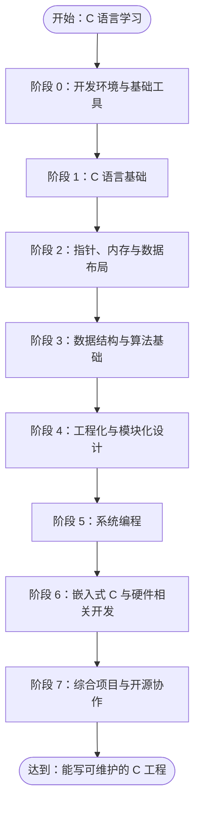

# C 语言学习 Roadmap：从语法到工程实践

> 目标：不只是“会写 C 语法”，而是逐步具备使用 C 语言完成真实工程、库设计、系统编程、嵌入式开发的能力。

## 总览



------

# 阶段 0：开发环境与基础工具

> 建议周期：1 ~ 2 周
> 目标：能独立编译、运行、调试 C 程序，理解最基本的工程构建流程。

## 核心知识点

- C 编译流程
  - 预处理
  - 编译
  - 汇编
  - 链接
- 常见编译器
  - GCC
  - Clang
  - MSVC 基础了解
- 常用编译参数
  - `-Wall`
  - `-Wextra`
  - `-Werror`
  - `-g`
  - `-O0`
  - `-O2`
  - `-std=c99`
  - `-std=c11`
- 基础调试工具
  - GDB
  - LLDB
- 基础工程工具
  - Makefile
  - CMake 入门
- 代码格式化
  - clang-format
- 版本管理
  - Git 基础操作
  - GitHub 提交 PR 基础流程

## 推荐小练习

- 写一个 `hello.c`，观察预处理、汇编、目标文件和可执行文件。
- 用 `gcc -E` 查看宏展开结果。
- 用 `gdb` 单步调试一个简单程序。
- 写一个最小 Makefile 管理多个 `.c` 文件。

## 阶段产出

- 一个最小 C 工程模板：

```text
project/
├── include/
├── src/
├── tests/
├── Makefile
└── README.md
```

------

# 阶段 1：C 语言基础

> 建议周期：3 ~ 5 周
> 目标：熟练掌握 C 语言基本语法，并能写出结构清晰的小程序。

## 核心知识点

### 1. 基本语法

- 变量与常量
- 基本数据类型
  - `char`
  - `short`
  - `int`
  - `long`
  - `long long`
  - `float`
  - `double`
- 有符号与无符号类型
  - `signed`
  - `unsigned`
- 类型转换
  - 隐式转换
  - 显式转换
- 运算符
  - 算术运算符
  - 关系运算符
  - 逻辑运算符
  - 位运算符
  - 赋值运算符
  - 三目运算符

### 2. 控制流

- `if / else`
- `switch / case`
- `for`
- `while`
- `do while`
- `break`
- `continue`
- `goto` 的合理与不合理使用

### 3. 函数

- 函数声明与定义
- 参数传递
- 返回值
- 递归
- 函数作用域
- 头文件声明
- `static` 函数

### 4. 数组与字符串

- 一维数组
- 二维数组
- 字符数组
- C 字符串
- `strlen`
- `strcpy`
- `strcmp`
- `strcat`
- 字符串越界风险

### 5. 基础输入输出

- `printf`
- `scanf`
- `fgets`
- `puts`
- 格式化输入输出
- 缓冲区问题

## 推荐项目

### 项目 1：命令行计算器

支持：

- 加减乘除
- 括号表达式可后续扩展
- 错误输入提示

### 项目 2：学生成绩管理系统

支持：

- 添加学生
- 删除学生
- 修改成绩
- 查询成绩
- 排序输出

### 项目 3：字符串工具箱

实现：

- 字符串反转
- 字符串查找
- 字符串分割
- 字符串替换
- 大小写转换

------

# 阶段 2：指针、内存与数据布局

> 建议周期：4 ~ 6 周
> 目标：真正理解 C 语言的核心能力：指针、内存、对象布局和手动资源管理。

## 核心知识点

### 1. 指针基础

- 指针变量
- 取地址 `&`
- 解引用 `*`
- 空指针 `NULL`
- 野指针
- 悬空指针
- 指针与数组
- 指针运算
- 多级指针

### 2. 指针与函数

- 指针作为函数参数
- 通过指针修改外部变量
- 指针作为返回值的风险
- 函数指针
- 回调函数
- 函数指针数组

### 3. 内存区域

- 栈区
- 堆区
- 全局区 / 静态区
- 代码区
- 常量区
- 生命周期与作用域

### 4. 动态内存管理

- `malloc`
- `calloc`
- `realloc`
- `free`
- 内存泄漏
- 重复释放
- 越界访问
- use-after-free

### 5. 结构体与联合体

- `struct`
- `union`
- `enum`
- 结构体嵌套
- 结构体数组
- 结构体指针
- 内存对齐
- 位域
- 柔性数组成员

### 6. 高级类型声明

- `const`
- `volatile`
- `static`
- `extern`
- `typedef`
- 复杂声明阅读方法

## 推荐项目

### 项目 1：动态数组 Vector

实现：

- 初始化
- 扩容
- 插入
- 删除
- 查找
- 遍历
- 销毁

### 项目 2：字符串类 CString

实现：

- 动态字符串
- 自动扩容
- 拼接
- 截取
- 查找
- 替换

### 项目 3：通用链表库

实现：

- 单向链表
- 双向链表
- 通用 `void*` 数据接口
- 自定义释放函数
- 迭代器式遍历接口

------

# 阶段 3：数据结构与算法基础

> 建议周期：4 ~ 8 周
> 目标：能够用 C 实现常见数据结构，并理解其复杂度和应用场景。

## 核心知识点

### 1. 线性结构

- 顺序表
- 单链表
- 双链表
- 循环链表
- 栈
- 队列
- 环形缓冲区

### 2. 树结构

- 二叉树
- 二叉搜索树
- AVL 树基础
- 堆
- 优先队列
- Trie 树

### 3. 哈希结构

- 哈希函数
- 开放寻址
- 链地址法
- 扩容与负载因子
- 字符串哈希

### 4. 排序算法

- 冒泡排序
- 插入排序
- 选择排序
- 快速排序
- 归并排序
- 堆排序
- 计数排序基础

### 5. 搜索算法

- 线性搜索
- 二分搜索
- BFS
- DFS

### 6. 字符串算法

- KMP
- Trie
- 简单正则匹配
- 字符串哈希

## 推荐项目

### 项目 1：C STL Mini

实现一组基础容器：

- `vector`
- `list`
- `stack`
- `queue`
- `hashmap`

### 项目 2：通用环形缓冲区

适合嵌入式和系统编程：

- 固定容量
- 无动态内存版本
- 支持读写索引
- 支持覆盖模式
- 支持非覆盖模式

### 项目 3：命令行词频统计工具

实现：

- 读取文本文件
- 分词
- 使用哈希表统计词频
- 按词频排序输出

------

# 阶段 4：工程化与模块化设计

> 建议周期：4 ~ 6 周
> 目标：从“会写 C 文件”进化到“能组织 C 工程”。

## 核心知识点

### 1. 头文件设计

- `.h` 与 `.c` 分离
- include guard
- 前向声明
- 公开接口与私有实现
- API 设计原则

### 2. 模块化设计

- 单一职责
- 接口稳定性
- 模块依赖管理
- 错误码设计
- 上下文对象设计
- 资源初始化与释放成对出现

### 3. 构建系统

- Makefile 多目录管理
- 静态库 `.a`
- 动态库 `.so`
- CMake 基础
- Debug / Release 构建

### 4. 测试

- assert
- 单元测试
- 边界测试
- 内存错误测试
- Mock 基础

### 5. 调试与分析

- GDB
- Valgrind
- AddressSanitizer
- UndefinedBehaviorSanitizer
- gcov / lcov 覆盖率基础

### 6. 文档与规范

- README
- CHANGELOG
- API 文档
- Doxygen
- 代码风格规范
- 提交规范

## 推荐项目

### 项目 1：C 基础库

实现一个可复用的基础库：

```text
clib/
├── include/
│   └── clib/
│       ├── vector.h
│       ├── string.h
│       ├── list.h
│       ├── hashmap.h
│       └── ring_buffer.h
├── src/
├── tests/
├── examples/
├── CMakeLists.txt
└── README.md
```

### 项目 2：日志库

实现：

- 日志等级
- 彩色输出
- 文件输出
- 时间戳
- 模块名
- 可关闭调试日志
- 线程安全可选

### 项目 3：配置文件解析器

支持：

- `.ini`
- key-value
- section
- 注释
- 错误行提示

------

# 阶段 5：系统编程

> 建议周期：6 ~ 10 周
> 目标：掌握 C 在操作系统层面的核心能力，能写出涉及进程、线程、网络与高并发的真实程序。

## 核心知识点

### 1. 进程与环境

- `fork` / `exec` / `wait`
- 进程退出 `exit` / `_exit` / `atexit`
- 环境变量 `environ` / `getenv` / `setenv`
- 守护进程（daemon）创建

### 2. 进程间通信（IPC）

- 管道 `pipe` / 命名管道 `mkfifo`
- 消息队列 / 共享内存 / 信号量（System V 与 POSIX）
- 信号 `signal` / `sigaction` / 信号屏蔽

### 3. 文件与底层 IO

- 文件描述符
- `open` / `read` / `write` / `close`
- 缓冲与无缓冲 IO 的区别
- `dup` / `dup2` 与重定向
- 文件锁

### 4. 多线程

- `pthread` 线程创建 / `join` / `detach`
- 互斥锁 `mutex`
- 条件变量 condition variable
- 读写锁 / 自旋锁
- 线程安全与可重入
- 死锁的成因与规避

### 5. IO 多路复用

- `select`
- `poll`
- `epoll`（水平触发 / 边沿触发）
- 非阻塞 IO
- Reactor 事件驱动模型

### 6. 网络编程

- Socket API 基础
- TCP 服务器 / 客户端
- UDP 通信
- 字节序转换与地址转换
- HTTP 协议基础

## 推荐项目

### 项目 1：Mini Shell

实现：

- 命令解析
- 管道 `|`
- 输入输出重定向
- `fork` / `exec` 执行外部命令
- 内建命令（`cd`、`exit`）

### 项目 2：并发 HTTP Server

实现：

- 基于 `epoll` 的事件循环
- 线程池处理连接
- 解析 HTTP 请求
- 返回静态文件 / 简单动态响应

### 项目 3：多人聊天室

实现：

- TCP 长连接
- 多客户端广播
- 客户端上线 / 离线通知
- 基于 epoll 或多线程并发

------

# 阶段 6：嵌入式 C 与硬件相关开发

> 建议周期：6 ~ 12 周
> 目标：掌握 C 在嵌入式环境下的核心用法，理解寄存器、外设、内存和实时性。

## 核心知识点

### 1. 嵌入式 C 基础

- 裸机程序结构
- 启动文件基础
- 链接脚本基础
- 中断向量表
- 栈初始化
- `volatile`
- 内存映射寄存器
- 位操作
- 宏封装寄存器

### 2. 常见外设驱动

- GPIO
- UART
- Timer / PWM
- SPI
- I2C
- ADC
- DMA

### 3. 中断与实时性

- 中断服务程序（ISR）
- 临界区保护
- 中断与主循环的通信
- 优先级与中断嵌套

### 4. 实时操作系统（RTOS）

- FreeRTOS 任务（Task）
- 队列（Queue）
- 信号量 / 互斥量
- 任务优先级与调度

### 5. 分层架构设计

- BSP（板级支持包）
- Driver（驱动层）
- Middleware（中间件）
- App（应用层）
- 各层之间的接口设计

## 推荐项目

### 项目 1：串口 Shell

实现：

- 通过 UART 接收命令
- 命令注册与分发
- 历史命令（可选）

### 项目 2：Button 按键框架

实现：

- 消抖
- 单击 / 双击 / 长按识别
- 事件回调

### 项目 3：嵌入式简易 GUI

实现：

- 基本图形原语（点、线、矩形）
- 字符显示
- 简单菜单 / 状态刷新

------

# 阶段 7：综合项目与开源协作

> 建议周期：持续进行
> 目标：把前面阶段的成果沉淀为可维护、可发布、可协作的真实项目，掌握现代开源工程的工作流。

## 核心知识点

### 1. 版本协作进阶

- Git 分支策略（feature 分支、长期分支）
- `rebase` / `cherry-pick`
- PR（Pull Request）流程规范
- Code Review 规范与要点

### 2. 持续集成（CI）

- GitHub Actions 基础
- 自动编译 / 测试 / lint
- 多平台矩阵构建（Linux / macOS）
- 制品发布

### 3. 质量保障自动化

- 静态分析 `cppcheck` / `clang-tidy`
- 覆盖率 `gcov` / `lcov`
- 内存检测 `Valgrind` / ASan 集成到 CI

### 4. 开源协作实践

- Issue 模板 / PR 模板
- `CONTRIBUTING.md` / `CODE_OF_CONDUCT`
- 文档与发布：`CHANGELOG`、Tag、Release
- 开源许可证选择

## 推荐项目

### 项目 1：把 clib 基础库发布为开源项目

实现：

- 完整的 CI（编译 / 测试 / 覆盖率）
- Doxygen 文档自动发布
- 规范的 README 与 CONTRIBUTING
- 版本 Tag 与 Release

### 项目 2：参与一个真实 C 开源项目

实践：

- 阅读项目结构与贡献指南
- 从修复小 Issue 开始
- 提交符合规范的 PR 并通过 Review

### 项目 3：综合毕业项目（自选）

融合系统编程 + 嵌入式 + 工程化能力，例如：

- 一个完整的嵌入式网关
- 一个带 Web 管理界面的后台服务
- 一个跨平台工具库

------

# Mermaid 详细路线图

```mermaid
flowchart TD
    A([开始学习 C 语言]) --> B[阶段 0：开发环境与工具]

    B --> B1[编译流程：预处理 / 编译 / 汇编 / 链接]
    B --> B2[GCC / Clang / MSVC 基础]
    B --> B3[GDB / LLDB 调试]
    B --> B4[Makefile / CMake 入门]
    B --> B5[Git / GitHub / PR 流程]

    B --> C[阶段 1：C 语言基础]

    C --> C1[变量 / 类型 / 运算符]
    C --> C2[if / switch / for / while]
    C --> C3[函数 / 递归 / 作用域]
    C --> C4[数组 / 字符串]
    C --> C5[printf / scanf / fgets]
    C --> C6[项目：计算器 / 成绩管理 / 字符串工具]

    C --> D[阶段 2：指针、内存与数据布局]

    D --> D1[指针 / 空指针 / 野指针 / 悬空指针]
    D --> D2[数组与指针 / 多级指针]
    D --> D3[函数指针 / 回调函数]
    D --> D4[malloc / calloc / realloc / free]
    D --> D5[struct / union / enum / 位域 / 柔性数组]
    D --> D6[内存对齐 / 栈 / 堆 / 全局区 / 代码区]
    D --> D7[项目：Vector / CString / 通用链表]

    D --> E[阶段 3：数据结构与算法]

    E --> E1[顺序表 / 链表 / 栈 / 队列]
    E --> E2[环形缓冲区]
    E --> E3[树 / 堆 / Trie]
    E --> E4[哈希表：开放寻址 / 链地址法]
    E --> E5[排序：快排 / 归并 / 堆排]
    E --> E6[搜索：二分 / BFS / DFS]
    E --> E7[字符串算法：KMP / Trie / Hash]
    E --> E8[项目：C STL Mini / 词频统计工具]

    E --> F[阶段 4：工程化与模块化设计]

    F --> F1[头文件设计 / include guard / 前向声明]
    F --> F2[API 设计 / 错误码 / 上下文对象]
    F --> F3[静态库 / 动态库]
    F --> F4[单元测试 / Mock / 覆盖率]
    F --> F5[Valgrind / ASan / UBSan]
    F --> F6[README / Doxygen / 代码规范]
    F --> F7[项目：C 基础库 / 日志库 / 配置解析器]

    F --> SYS[阶段 5：系统编程]

    SYS --> SYS1[fork / exec / wait / 守护进程]
    SYS --> SYS2[IPC：管道 / 共享内存 / 信号 / 信号量]
    SYS --> SYS3[文件描述符 / open / read / write / dup]
    SYS --> SYS4[pthread / mutex / 条件变量 / 线程安全]
    SYS --> SYS5[IO 多路复用：select / poll / epoll]
    SYS --> SYS6[Socket / TCP / UDP / HTTP 基础]
    SYS --> SYS7[项目：Mini Shell / HTTP Server / 聊天室]

    SYS --> G[阶段 6：嵌入式 C 与硬件开发]

    G --> G1[裸机程序 / 启动文件 / 链接脚本]
    G --> G2[volatile / 内存映射寄存器 / 位操作]
    G --> G3[GPIO / UART / Timer / PWM]
    G --> G4[SPI / I2C / ADC / DMA]
    G --> G5[中断 / 临界区 / 主循环通信]
    G --> G6[FreeRTOS：任务 / 队列 / 信号量]
    G --> G7[BSP / Driver / Middleware / App 分层]
    G --> G8[项目：串口 Shell / Button 框架 / 嵌入式 GUI]

    G --> CAP[阶段 7：综合项目与开源协作]

    CAP --> CAP1[Git 分支策略 / rebase / PR / Code Review]
    CAP --> CAP2[GitHub Actions / CI 自动化]
    CAP --> CAP3[静态分析 / 覆盖率 / 内存检测集成]
    CAP --> CAP4[CONTRIBUTING / 模板 / CHANGELOG / Release]
    CAP --> CAP5[项目：发布 clib / 贡献开源项目 / 综合毕业项目]

    CAP --> H([目标：能独立维护 C 语言工程])
```


